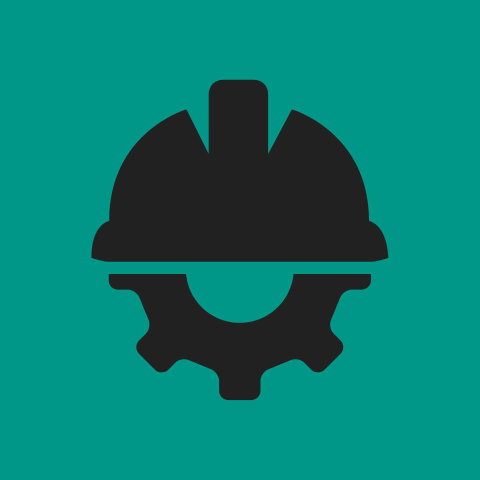

# FieldMeasure 📏

**A simple and powerful toolkit for on-the-go height and distance estimations. Built with Flutter.**

---

## 🌟 About The Project

FieldMeasure is a mobile application designed for professionals and hobbyists who need quick and easy measurements in the field. Whether you're a lumberjack estimating tree height, a construction worker assessing a building, or just curious about the world around you, FieldMeasure provides two core utilities right on your phone.

The app uses your phone's camera and motion sensors to calculate the height of objects and leverages GPS to estimate the distance between two points.

*(This is a placeholder for a real promotional screenshot. I highly recommend you create a nice graphic like this!)*

### Key Features:
*   **📐 Height Measurement:** Calculate the height of any object by aiming at its base and top.
*   **🗺️ Distance Estimation:** Measure the walking distance between two points using GPS.
*   **🌗 Dual Theme:** A sleek and modern interface available in both Light and Dark modes.
*   **📱 Cross-Platform:** Built with a single codebase for both Android and iOS.
*   **⬆️ In-App Updates:** Stay up-to-date with the latest features thanks to in-app update notifications.

---

## 🛠️ Built With

*   [**Flutter**](https://flutter.dev/) - The core framework for building the app.
*   [**Provider**](https://pub.dev/packages/provider) - For state management, especially theme switching.
*   [**Upgrader**](https://pub.dev/packages/upgrader) - To alert users about new app versions.
*   [**camera**](https://pub.dev/packages/camera) - To access the device camera for height measurement.
*   [**motion_sensors**](https://pub.dev/packages/motion_sensors) - To get device orientation angles.
*   [**geolocator**](https://pub.dev/packages/geolocator) - For GPS-based distance calculation.

---

## 🚀 Getting Started

To get a local copy up and running, follow these simple steps.

### Prerequisites

*   You must have [Flutter](https://docs.flutter.dev/get-started/install) installed on your machine.
*   An Android Emulator or a physical device.

### Installation

1.  **Clone the repo**
    